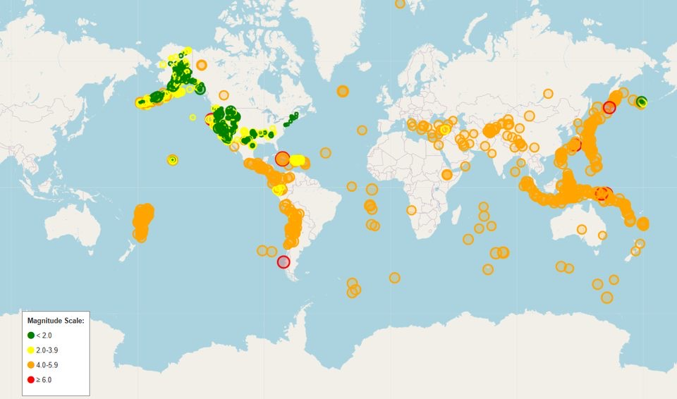
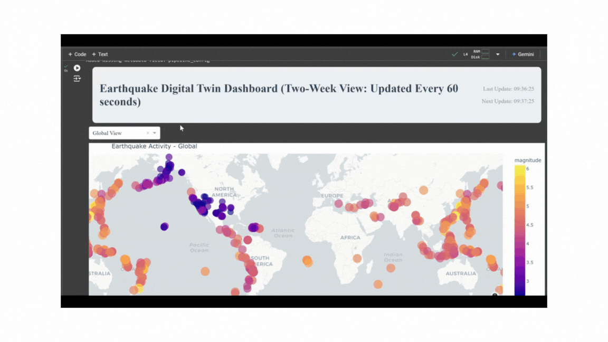

# Earthquake Prediction Tool Documentation



## Overview
The Earthquake Prediction Pipeline is a comprehensive system that automates the collection, processing, and analysis of USGS earthquake data using three distinct models to predict and classify seismic activity:

1. **Global Regression Transformer**: Predicts the total number of earthquakes likely to occur in the next 24-hour period across all regions, learning from global seismic patterns.

2. **Regional Regression Transformer**: Provides region-specific earthquake count predictions for five key seismic zones (Pacific Northwest, California, Alaska, Hawaii, and Central US), accounting for local geological characteristics.

3. **Risk Level Classification Model**: A Multi-Layer Perceptron (MLP) classifier that categorizes earthquake events into risk levels (Low, Medium, High) based on magnitude, depth, and significance features.

Link to data feed: [USGS Data Feed](https://earthquake.usgs.gov/earthquakes/feed/)

Link to presentation: [UCF - IDS 6938: Project Presentation](https://youtu.be/Czvyl98B_V8)

## System Requirements

### Python 3.x Required Libraries:
- pandas - Data manipulation and analysis
- numpy - Numerical computing
- torch (PyTorch) - Deep learning framework and model creation
- requests - API data collection
- matplotlib/seaborn - Visualization
- scikit-learn - Risk classification and evaluation metrics
- scipy - Statistical computations

### Ensure to run with GPU (Parallel Processing)

### **Usage Examples**
##### **Initialize Pipeline**
pipeline = EarthquakePipeline(drive_path='/path/to/base/directory')
##### **Run Baseline Training**
pipeline.run_baseline_training(days_to_process=31)
##### **Start Continuous Monitoring**
pipeline.run_continuous_monitoring(update_interval=3600)  # 1 hour interval

## Resources
- [USGS Earthquake API Documentation](https://earthquake.usgs.gov/fdsnws/event/1/)
- [PyTorch Documentation](https://pytorch.org/docs/stable/index.html)
- [Scikit-learn Documentation](https://scikit-learn.org/stable/)

## Directory Structure

```
/earthquake_data/
├── global/                 # Global prediction pipeline
│   ├── data/              # Raw daily earthquake data
│   │   └── YYYY-MM/       # Organized by year-month
│   ├── models/            # Saved model checkpoints
│   ├── predictions/       # Daily prediction outputs
│   ├── plots/             # Performance visualizations
│   └── evaluations/       # Evaluation metrics
│
└── regional/              # Regional prediction pipeline
├── data/              # Regional data directories
│   ├── pacific_northwest/
│   ├── california/
│   ├── alaska/
│   ├── hawaii/
│   └── central_us/
├── models/            # Regional model checkpoints
│   ├── pacific_northwest/
│   ├── california/
│   ├── alaska/
│   ├── hawaii/
│   └── central_us/
├── predictions/       # Regional predictions
├── plots/             # Regional visualizations
└── evaluations/       # Regional metrics
```

## Core Components

### 1. Data Collection and Processing
- USGS API Integration: Automated fetching of earthquake data
- Data Filtering: Configurable magnitude threshold (default: 2.5)
- Regional Assignment: Automatic categorization into defined seismic zones
- Feature Extraction: Geographic and seismic parameters
- Data Storage: Daily CSV files with comprehensive metadata

### 2. Model Architecture

#### 2.a. Global Transformer
- Purpose: Global earthquake count prediction
- Components:
  - Input projection layer
  - Positional encoding
  - Multi-head attention layers
  - Feed-forward networks
  - Output projection layer
- Parameters:
  - Sequence Length: Configurable (default: 7 days)
  - Hidden Dimensions: 64
  - Number of Layers: 2
  - Attention Heads: 4

#### 2.b. Regional Transformer
- Purpose: Region-specific count predictions
- Architecture: Similar to global transformer
- Key Difference: Separate model instances for each region
- Additional Features:
  - Region-specific parameter tuning
  - Local pattern recognition
  - Regional confidence intervals

#### 2.c. Risk Classification Model
- Type: Multi-Layer Perceptron (MLP)
- Purpose: Earthquake risk level classification
- Architecture:
  - Input Layer: Processed features (magnitude, depth, significance)
  - Hidden Layers: (128, 64, 64) neurons
  - Output Layer: 3 classes (Low, Medium, High risk)
- Features:
  - Probability scoring for each risk level
  - Confidence threshold adjustments
  - Incremental learning capabilities

### 3. Performance Metrics
- Count Prediction:
  - Mean Absolute Error (MAE)
  - Root Mean Squared Error (RMSE)
  - Regional prediction accuracy
  - Confidence interval coverage

- Risk Classification:
  - Accuracy, Precision, Recall, F1 Score
  - Confusion Matrix

### 4. Hypothesis Testing Results
Null Hypothesis: No difference between regional and global prediction errors
Alternate Hypothesis: Regional model has lower prediction errors than global model
  
- Pacific Northwest Region
- 
    - Mean Error (Regional): 1.5 +/- 0.40
    - Mean Error (Global): 11.20 +/- 7.52
    - No statistically significant difference between models (p = 0.0577)
- California Region
- 
    - Mean Error (Regional): 0.91 +/- 1.09
    - Mean Error (Global): 9.22 +/- 6.10
    - Statistically significant improvement with regional model (p = 0.0001)   
- Alaska Region
- 
    - Mean Error (Regional): 3.55 +/- 2.48
    - Mean Error (Global): 8.22 +/- 5.86
    - Statistically significant improvement with regional model (p = 0.0011) 
- Hawaii Region
- 
    - Mean Error (Regional): 1.45 +/- 0.50
    - Mean Error (Global): 9.50 +/- 6.38
    - Statistically significant improvement with regional model (p = 0.0053)
- Central US
  - Insufficient data for analysis   

Conclusions
  - Regional models significantly outperformed the global model in 3 out of 4 regions
  - The Pacific Northwest showed improvement but fell just short of statistical significance
  - Regional models consistently demonstrated lower error rates and standard deviations
  - Results suggest that region-specific models provide more accurate predictions than a one-size-fits-all global model


## Dashboard Demo


## Authors
- Stephen Moore
- Steven Wilhelm
- Lynn Yingling

## Version
6.0 (Last Updated: 30 November 2024)
